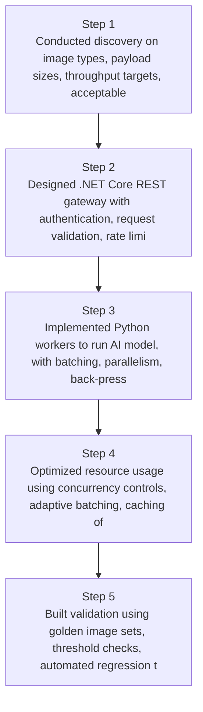
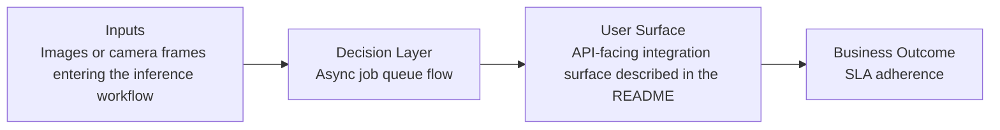
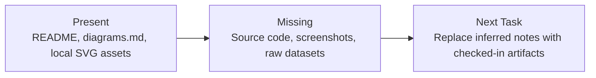

# Scalable Image Processing API Diagrams

Generated on 2026-04-26T04:29:37Z from README narrative plus project blueprint requirements.

## API gateway + worker architecture

## Async job queue flow

## Evidence Gap Map

